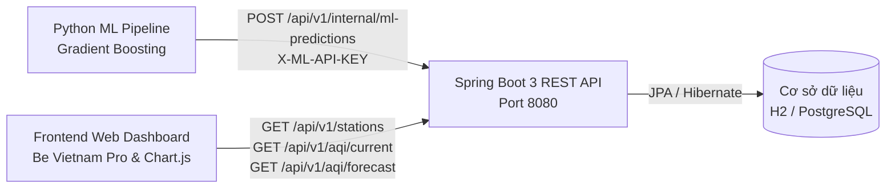

# 📜 HỢP ĐỒNG GIAO DIỆN LẬP TRÌNH ỨNG DỤNG (API CONTRACT)
## Hệ Thống Quan Trắc, Cảnh Báo AQI & Lập Kế Hoạch Di Chuyển Cho Nhóm Nhạy Cảm
> **Phiên bản:** v2.5 (Đồng bộ hoàn chỉnh Frontend Glassmorphism, Backend Spring Boot 3 & Python ML Service)  
> **Cơ quan bảo trợ chuyên môn:** Hợp tác cùng Sở Tài nguyên & Môi trường Thành phố  
> **Cập nhật lần cuối:** 16/09/2026  

---

## 1. TỔNG QUAN HỆ THỐNG & QUY ƯỚC CHUNG

### 1.1. Kiến Trúc Tích Hợp API
Hệ thống hoạt động theo mô hình 3 tầng dịch vụ:


### 1.2. Môi Trường Vận Hành (Base URLs)
| Môi trường | Base URL | Mục đích |
| :--- | :--- | :--- |
| **Local Development** | `http://localhost:8080` | Môi trường kiểm thử nội bộ (mặc định với H2 in-memory DB) |
| **Staging / QA** | `https://staging-aqi.hcmc.gov.vn` | Môi trường nghiệm thu nghiệp vụ với Sở TN&MT |
| **Production** | `https://aqi-monitor.hcmc.gov.vn` | Hệ thống phục vụ người dân và cán bộ quan trắc |

### 1.3. Chuẩn Giao Tiếp & Tiêu Đề HTTP (Headers)
- Tất cả các endpoint đều hỗ trợ CORS (`@CrossOrigin(origins = "*")`).
- Định dạng dữ liệu mặc định: `application/json; charset=UTF-8`.
- Định dạng thời gian: Chuẩn ISO-8601 UTC / Local (ví dụ: `2026-09-16T11:00:00+07:00` hoặc `2026-09-16T04:00:00Z`).

#### Cấu Trúc Phản Hồi Thành Công Chuẩn:
```json
{
  "success": true,
  "data": { ... },
  "timestamp": "2026-09-16T11:38:00+07:00"
}
```

#### Cấu Trúc Phản Hồi Lỗi Chuẩn:
```json
{
  "success": false,
  "errorCode": "STATION_NOT_FOUND",
  "message": "Không tìm thấy thông tin trạm quan trắc với ID cung cấp.",
  "timestamp": "2026-09-16T11:38:00+07:00"
}
```

---

## 2. PHÂN HỆ API DÀNH CHO CỘNG ĐỒNG (PUBLIC API)

### 2.1. API 1: Lấy Danh Sách 12 Trạm Quan Trắc Toàn Thành Phố
Lấy danh sách các trạm quan trắc khí quyển đang hoạt động để người dân lựa chọn trên thanh Top Bar.

- **Method:** `GET`
- **Endpoint:** `/api/v1/stations` (Alias: `/api/v2/public/stations`)
- **Xác thực:** Không yêu cầu (Public)
- **Tham số:** Không có
- **Phản hồi mẫu (`200 OK`):**
```json
{
  "success": true,
  "total": 12,
  "data": [
    {
      "stationId": 1,
      "name": "Guanyuan",
      "district": "Quận Tây Thành",
      "latitude": 39.929,
      "longitude": 116.339,
      "status": "Active"
    },
    {
      "stationId": 2,
      "name": "Dongsi",
      "district": "Quận Đông Thành",
      "latitude": 39.929,
      "longitude": 116.417,
      "status": "Active"
    },
    {
      "stationId": 3,
      "name": "Tiantan",
      "district": "Quận Sùng Văn",
      "latitude": 39.886,
      "longitude": 116.407,
      "status": "Active"
    }
  ],
  "timestamp": "2026-09-16T11:38:00+07:00"
}
```

---

### 2.2. API 2: Lấy Chất Lượng Không Khí Thời Gian Thực Của Trạm
Cung cấp chỉ số AQI và nồng độ các chất ô nhiễm hàng giờ tại thời điểm hiện tại để hiển thị trên đồng hồ tròn AQI (`Glass Circular Gauge`).

- **Method:** `GET`
- **Endpoint:** `/api/v1/aqi/current` (Alias: `/api/v2/public/aqi/current`)
- **Query Parameters:**
  | Tên tham số | Kiểu | Bắt buộc | Mặc định | Mô tả |
  | :--- | :--- | :--- | :--- | :--- |
  | `stationId` | Long | Không | `1` | Mã định danh trạm quan trắc |
- **Phản hồi mẫu (`200 OK`):**
```json
{
  "success": true,
  "data": {
    "stationId": 1,
    "stationName": "Guanyuan",
    "observedAt": "2026-09-16T11:00:00+07:00",
    "aqi": 68,
    "category": {
      "level": "Moderate",
      "labelVi": "Trung bình",
      "color": "#facc15",
      "textColor": "#0f172a",
      "adviceGeneral": "Chất lượng không khí ở mức chấp nhận được cho đa số người dân.",
      "adviceSensitive": "Nhóm cực kỳ nhạy cảm nên chú ý hạn chế ở ngoài trời quá lâu lúc kẹt xe."
    },
    "dominantPollutant": "PM2.5",
    "pollutants": {
      "pm25": { "value": 24.6, "unit": "µg/m³", "subIndex": 68 },
      "pm10": { "value": 48.2, "unit": "µg/m³", "subIndex": 44 },
      "so2": { "value": 8.5, "unit": "µg/m³", "subIndex": 12 },
      "no2": { "value": 32.1, "unit": "µg/m³", "subIndex": 30 },
      "co": { "value": 680.0, "unit": "µg/m³", "subIndex": 18 },
      "o3": { "value": 54.0, "unit": "µg/m³", "subIndex": 38 }
    },
    "weather": {
      "temperature": 28.5,
      "humidity": 65.0,
      "pressure": 1008.2,
      "windSpeed": 2.4,
      "windDirection": "SE"
    }
  },
  "timestamp": "2026-09-16T11:38:00+07:00"
}
```

---

### 2.3. API 3: Lấy Chuỗi Dữ Liệu Dự Báo 48 Giờ (2 Ngày Tới)
Cung cấp dự báo chi tiết từng giờ cho 48 giờ tiếp theo được sinh ra từ mô hình Gradient Boosting, phục vụ vẽ Biểu đồ Dự Báo 48h (`Chart 1`).

- **Method:** `GET`
- **Endpoint:** `/api/v1/aqi/forecast` (Alias: `/api/v1/aqi/forecast-2days`)
- **Query Parameters:**
  | Tên tham số | Kiểu | Bắt buộc | Mặc định | Mô tả |
  | :--- | :--- | :--- | :--- | :--- |
  | `stationId` | Long | Không | `1` | Mã định danh trạm quan trắc |
- **Phản hồi mẫu (`200 OK`):**
```json
{
  "success": true,
  "stationId": 1,
  "stationName": "Guanyuan",
  "forecastHorizonHours": 48,
  "totalRecords": 48,
  "data": [
    {
      "step": 1,
      "targetTime": "2026-09-16T12:00:00+07:00",
      "predictedAqi": 72,
      "level": "Moderate",
      "predictedPm25": 26.2,
      "confidenceInterval": { "lower": 65, "upper": 79 }
    },
    {
      "step": 2,
      "targetTime": "2026-09-16T13:00:00+07:00",
      "predictedAqi": 65,
      "level": "Moderate",
      "predictedPm25": 23.1,
      "confidenceInterval": { "lower": 58, "upper": 72 }
    }
  ],
  "summary": {
    "avgAqi": 78,
    "maxAqi": 118,
    "maxTime": "2026-09-17T08:00:00+07:00",
    "minAqi": 48,
    "minTime": "2026-09-16T15:00:00+07:00"
  },
  "timestamp": "2026-09-16T11:38:00+07:00"
}
```

---

### 2.4. API 4: Kế Hoạch Di Chuyển Theo Giờ & Khuyến Cáo Y Tế (Travel Safety Planner)
Cung cấp phân tích 24 giờ trong ngày để xác định khung giờ vàng di chuyển và đưa ra lời khuyên y tế cá nhân hóa theo nhóm đối tượng (`general`, `children`, `elderly`, `asthma`).

- **Method:** `GET`
- **Endpoint:** `/api/v1/advisory/travel-plan` (Alias: `/api/v2/public/travel-plan`)
- **Query Parameters:**
  | Tên tham số | Kiểu | Bắt buộc | Mặc định | Giá trị hợp lệ |
  | :--- | :--- | :--- | :--- | :--- |
  | `stationId` | Long | Không | `1` | ID trạm |
  | `persona` | String | Không | `general` | `general`, `children`, `elderly`, `asthma` |
  | `dayOffset` | Integer | Không | `0` | `0` (Hôm nay), `1` (Ngày mai), `2` (Ngày mốt) |
- **Phản hồi mẫu (`200 OK`):**
```json
{
  "success": true,
  "data": {
    "stationId": 1,
    "persona": "children",
    "personaTitle": "Trẻ em & Học sinh (Ngưỡng AQI > 100)",
    "targetDate": "2026-09-16",
    "dayName": "Hôm nay",
    "goldenHours": {
      "bestHour": 15,
      "bestAqi": 48,
      "safestWindow": "14:00 - 16:30",
      "recommendation": "Khung giờ vàng lý tưởng nhất để tổ chức hoạt động vui chơi thể thao ngoài trời."
    },
    "peakPollutionHours": {
      "worstHour": 8,
      "worstAqi": 118,
      "dangerWindow": "07:30 - 09:00",
      "warning": "Giờ cao điểm ô nhiễm do khói xe và bụi mịn nén sát mặt đất. Phụ huynh nên đưa đón con bằng phương tiện kín hoặc đeo khẩu trang N95."
    },
    "hourlyStatus": [
      { "hour": 0, "aqi": 85, "color": "#facc15", "safe": true },
      { "hour": 8, "aqi": 118, "color": "#fb923c", "safe": false },
      { "hour": 15, "aqi": 48, "color": "#10b981", "safe": true }
    ],
    "medicalAdvice": "Chất lượng không khí ở mức trung bình chấp nhận được. Trẻ có cơ địa viêm mũi họng dị ứng cần tránh chơi ngoài sân lúc trời nhiều gió bụi.",
    "routeGuidance": "Nên ưu tiên di chuyển trên các tuyến đường có nhiều cây xanh, tránh đứng lâu tại các nút giao thông có mật độ xe tải cao."
  },
  "timestamp": "2026-09-16T11:38:00+07:00"
}
```

---

### 2.5. API 5: Truy Vấn Lịch Sử Chất Lượng Không Khí
Cho phép cán bộ quan trắc hoặc người dân tra cứu diễn biến ô nhiễm trong quá khứ theo mốc thời gian.

- **Method:** `GET`
- **Endpoint:** `/api/v1/aqi/history` (Alias: `/api/v2/public/aqi/history`)
- **Query Parameters:**
  | Tên tham số | Kiểu | Bắt buộc | Mô tả |
  | :--- | :--- | :--- | :--- |
  | `stationId` | Long | Có | ID trạm quan trắc |
  | `fromDate` | ISO Date | Không | Thời điểm bắt đầu (ví dụ: `2026-09-01T00:00:00`) |
  | `toDate` | ISO Date | Không | Thời điểm kết thúc (ví dụ: `2026-09-10T23:59:59`) |
- **Phản hồi mẫu (`200 OK`):**
```json
[
  {
    "readingId": 10542,
    "stationId": 1,
    "datetime": "2026-09-01T00:00:00",
    "pm25": 18.5,
    "pm10": 35.0,
    "aqi": 45,
    "level": "Good"
  },
  {
    "readingId": 10543,
    "stationId": 1,
    "datetime": "2026-09-01T01:00:00",
    "pm25": 22.0,
    "pm10": 40.2,
    "aqi": 52,
    "level": "Moderate"
  }
]
```

---

### 2.6. API 6: Chính Sách Truy Cập Công Cộng (Public Registration)
- **Method:** `POST`
- **Endpoint:** `/api/v2/public/register`
- **Mô tả:** Hệ thống hoạt động hoàn toàn công khai và bảo vệ quyền riêng tư của nhân dân. Người dân có thể tra cứu và nhận thông tin cảnh báo tự do mà không bắt buộc khai báo số điện thoại hay thông tin định danh cá nhân.
- **Phản hồi mẫu (`200 OK`):**
```json
{
  "status": "PUBLIC_ACCESS_MODE",
  "message": "Hệ thống Cảnh báo AQI v2.0 phục vụ cộng đồng công khai. Người dân không cần đăng ký tài khoản hay khai báo thông tin cá nhân để tra cứu và nhận cảnh báo.",
  "accessPolicy": "Free & Anonymous",
  "supportedPersonas": ["general", "children", "elderly", "asthma"]
}
```

---

## 3. PHÂN HỆ TÍCH HỢP NỘI BỘ MACHINE LEARNING (INTERNAL ML API)

Phân hệ này sử dụng riêng cho script Python Machine Learning tự động nạp kết quả dự báo và đăng ký phiên bản mô hình vào cơ sở dữ liệu Spring Boot.

### 3.1. API 7: Nạp Kết Quả Dự Báo 48 Giờ Vào Backend
- **Method:** `POST`
- **Endpoint:** `/api/v1/internal/ml-predictions` (Alias: `/api/v2/internal/forecasts/ingest`)
- **Headers:**
  - `Content-Type: application/json`
  - `X-ML-API-KEY: aqi-ml-secret-key-2026` (Bảo mật kênh truyền nội bộ giữa Python và Spring Boot)
- **Request Body mẫu:**
```json
{
  "modelVersion": "v3.2.1",
  "generatedAt": "2026-09-16T04:00:00Z",
  "recordsCount": 576,
  "forecasts": [
    {
      "stationId": 1,
      "targetTime": "2026-09-16T05:00:00Z",
      "predictedAqi": 68,
      "predictedPm25": 24.5,
      "predictedPm10": 48.0,
      "predictedSo2": 8.0,
      "predictedNo2": 32.0,
      "predictedCo": 650.0,
      "predictedO3": 50.0
    }
  ]
}
```
- **Phản hồi mẫu (`200 OK`):**
```json
{
  "success": true,
  "savedRecords": 576,
  "activeModel": "v3.2.1",
  "message": "Đã nạp thành công 576 bản ghi dự báo 48h cho 12 trạm vào cơ sở dữ liệu.",
  "ingestedAt": "2026-09-16T11:38:00+07:00"
}
```

---

### 3.2. API 8: Đăng Ký Phiên Bản Mô Hình & Chỉ Số Kiểm Định
- **Method:** `POST`
- **Endpoint:** `/api/v1/internal/models/register`
- **Request Body mẫu:**
```json
{
  "version": "v3.2.1",
  "algorithm": "HistGradientBoostingRegressor",
  "featuresCount": 38,
  "metrics": {
    "trainingRows": 335692,
    "testingRows": 83924,
    "mae": 68.25,
    "rmse": 92.87,
    "r2Score": 0.642
  },
  "classificationAccuracy": 0.2266,
  "status": "Production"
}
```
- **Phản hồi mẫu (`201 Created`):**
```json
{
  "success": true,
  "modelId": 12,
  "version": "v3.2.1",
  "status": "Activated",
  "message": "Mô hình đã được kích hoạt làm nguồn dự báo chính thức trên toàn hệ thống."
}
```

---

## 4. PHÂN HỆ QUẢN TRỊ VIÊN & CÁN BỘ SỞ TN&MT (ADMIN API)

### 4.1. API 9: Báo Cáo Tổng Quan Giám Sát Đô Thị
- **Method:** `GET`
- **Endpoint:** `/api/v1/admin/dashboard/overview`
- **Phản hồi mẫu (`200 OK`):**
```json
{
  "success": true,
  "cityOverview": {
    "activeStations": 12,
    "totalStations": 12,
    "currentCityAvgAqi": 68.4,
    "cityLevel": "Moderate",
    "cleanestStation": { "name": "Dingling", "aqi": 42 },
    "dirtiestStation": { "name": "Wanshouxigong", "aqi": 98 }
  },
  "alertsToday": {
    "totalSent": 1540,
    "smsCount": 620,
    "appPushCount": 920
  }
}
```

---

## 5. BẢNG ĐỐI CHIẾU MÃ LỖI CHUẨN (STANDARD ERROR CODES)

| Mã lỗi (`errorCode`) | HTTP Status | Ý nghĩa | Hướng dẫn xử lý |
| :--- | :--- | :--- | :--- |
| `STATION_NOT_FOUND` | 404 Not Found | Không tìm thấy trạm quan trắc | Kiểm tra lại `stationId` (từ 1 đến 12) |
| `INVALID_PERSONA` | 400 Bad Request | Nhóm đối tượng không hợp lệ | Chỉ chấp nhận: `general`, `children`, `elderly`, `asthma` |
| `INVALID_DATE_FORMAT` | 400 Bad Request | Định dạng ngày giờ sai | Định dạng theo ISO-8601 `YYYY-MM-DDTHH:mm:ss` |
| `UNAUTHORIZED_ML_INGEST` | 401 Unauthorized | API Key của ML Service không đúng | Kiểm tra header `X-ML-API-KEY` |
| `FORECAST_DATA_EMPTY` | 422 Unprocessable | Dữ liệu batch dự báo rỗng | Kiểm tra pipeline trích xuất kết quả từ Python |
| `INTERNAL_SERVER_ERROR` | 500 Internal Error | Lỗi xử lý backend | Kiểm tra log Spring Boot |
