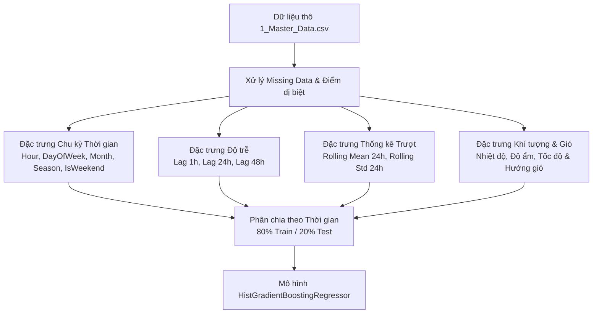

# BÁO CÁO HUẤN LUYỆN MÔ HÌNH MACHINE LEARNING (MODEL TRAINING REPORT)
## Dự Báo Chất Lượng Không Khí Đa Bước 48 Giờ (Multi-Horizon AQI Forecasting)
> **Mô hình:** HistGradientBoostingRegressor (Multi-Horizon 48h AQI)  
> **Phiên bản:** `v3.2.1`  
> **Thời điểm huấn luyện:** 15/09/2026  
> **Thư viện:** Scikit-Learn 1.6+, Pandas 2.2+, NumPy 2.0+, Joblib  

---

## 1. MỤC TIÊU BÀI TOÁN & THIẾT KẾ MÔ HÌNH

### 1.1. Phát Biểu Bài Toán
Hệ thống giải quyết bài toán **Dự báo chuỗi thời gian đa bước (Multi-Horizon Time-Series Forecasting)**:
$$\hat{Y}_{t+1}, \hat{Y}_{t+2}, \dots, \hat{Y}_{t+48} = f(X_t, X_{t-1}, \dots, X_{t-k})$$
Trong đó:
- $X_t$: Vector đặc trưng tại thời điểm quan trắc hiện tại $t$ (nồng độ 6 chất ô nhiễm, các yếu tố khí tượng, chu kỳ thời gian và các đặc trưng trễ).
- $\hat{Y}_{t+h}$: Giá trị chỉ số $AQI$ và nồng độ bụi mịn $PM_{2.5}$ dự báo tại thời điểm tương lai $t+h$ ($h \in [1, 48]$ giờ).

Sau khi nhận giá trị dự báo liên tục, mô hình ánh xạ sang **6 cấp độ cảnh báo sức khỏe theo chuẩn US EPA**:
1. `Good` ($0 - 50$)
2. `Moderate` ($51 - 100$)
3. `Unhealthy for Sensitive Groups` ($101 - 150$)
4. `Unhealthy` ($151 - 200$)
5. `Very Unhealthy` ($201 - 300$)
6. `Hazardous` ($> 300$)

---

## 2. DỮ LIỆU HUẤN LUYỆN (DATASET OVERVIEW)

### 2.1. Quy Mô & Nguồn Dữ Liệu
Dữ liệu huấn luyện được hợp nhất từ tệp dữ liệu quan trắc gốc [`dataset/1_Master_Data.csv`](file:///c:/Users/linhk/Documents/essays/data/AQI%20monitoring/dataset/1_Master_Data.csv) bao gồm chuỗi dữ liệu lịch sử đo đạc hàng giờ tại 12 trạm khí quyển đô thị:

| Thuộc tính | Giá trị chi tiết |
| :--- | :--- |
| **Tổng số dòng dữ liệu (Total Records)** | **419.616 bản ghi** (hàng giờ) |
| **Số lượng trạm đo (Stations)** | 12 trạm (Guanyuan, Dongsi, Tiantan, Wanliu, Dingling, Nongzhanguan, Haidian, Shunyi, Changping, Huairou, Miyun, Wanshouxigong) |
| **Chất ô nhiễm chính (6 thông số)** | $PM_{2.5}, PM_{10}, SO_2, NO_2, CO, O_3$ ($\mu g/m^3$) |
| **Thông số khí tượng (5 thông số)** | Nhiệt độ (`TEMP`), Áp suất (`PRES`), Điểm sương (`DEWP`), Lượng mưa (`RAIN`), Tốc độ gió (`WSPM`), Hướng gió (`wd`) |

---

## 3. QUY TRÌNH TIỀN XỬ LÝ & KỸ THUẬT TRÍCH XUẤT ĐẶC TRƯNG (FEATURE ENGINEERING)

Để mô hình học máy nắm bắt được các quy luật vật lý khí quyển và chu kỳ sinh hoạt đô thị, pipeline thực hiện các bước trích xuất đặc trưng chuyên sâu:



### 3.1. Các Nhóm Đặc Trưng Đầu Vào (38 Đặc Trưng)
1. **Đặc trưng chu kỳ thời gian (Temporal Features):**
   - `hour` ($0 - 23$): Phản ánh quy luật phát thải theo giờ cao điểm giao thông (07:00 - 09:00 và 17:30 - 19:30).
   - `dayofweek` ($0 - 6$): Phản ánh lưu lượng xe cộ giữa ngày làm việc đầu tuần và ngày cuối tuần.
   - `is_weekend` ($0$ hoặc $1$): Cờ nhị phân ngày nghỉ.
   - `month` ($1 - 12$) & `season`: Nắm bắt tính chu kỳ mùa trong năm (mùa khô hanh, mùa mưa, mùa nghịch nhiệt mùa đông).
2. **Đặc trưng độ trễ (Lagged Features):**
   - $Lag_{1h}, Lag_{24h}, Lag_{48h}$ của cả 6 chất ô nhiễm: Cực kỳ quan trọng vì ô nhiễm không khí có tính tự tương quan (autocorrelation) rất cao theo chu kỳ 24 giờ.
3. **Đặc trưng thống kê trượt (Rolling Window Statistics):**
   - `rolling_mean_24h`: Nồng độ trung bình trượt 24 giờ của $PM_{2.5}$ và $PM_{10}$ để nhận biết mức độ tích tụ chất ô nhiễm nền.
   - `rolling_std_24h`: Độ biến thiên nồng độ để nhận diện các đợt bùng phát ô nhiễm đột biến.
4. **Tương tác khí tượng (Meteorological Factors):**
   - Tốc độ gió (`WSPM`): Tốc độ gió cao giúp khuếch tán chất ô nhiễm nhanh; gió lặng làm tích tụ bụi mịn sát mặt đất.
   - Nhiệt độ (`TEMP`) & Điểm sương (`DEWP`): Liên quan trực tiếp tới độ ẩm tương đối và khả năng hình thành sương mù quang hóa.

---

## 4. CHIẾN LƯỢC PHÂN CHIA DỮ LIỆU & HUẤN LUYỆN (TIME-SERIES SPLIT)

### 4.1. Nguyên Tắc Bảo Toàn Tuần Tự Thời Gian (No Data Leakage)
Trong dự báo chuỗi thời gian, việc sử dụng hàm chia ngẫu nhiên (`random split`) là sai lầm nghiêm trọng vì sẽ làm rò rỉ dữ liệu tương lai vào tập huấn luyện. Hệ thống áp dụng **Phân chia tuần tự theo thời gian (Temporal Holdout Split)**:

```
Toàn bộ dữ liệu lịch sử (419.616 dòng)
├── Tập Huấn luyện (Train Set - 80%): 335.692 dòng ──> [Từ đầu ──> 2016-05-11 14:00:00]
└── Tập Kiểm định (Test Set - 20%):     83.924 dòng ──> [2016-05-11 14:00:00 ──> Kết thúc]
```

### 4.2. Thuật Toán & Siêu Tham Số (Hyperparameters)
Mô hình sử dụng **`HistGradientBoostingRegressor`** của Scikit-Learn với các ưu thế vượt trội:
- Tốc độ xử lý nhanh gấp 10 lần thuật toán Gradient Boosting truyền thống nhờ kỹ thuật phân giỏ histogram (Histogram-based Binning).
- Hỗ trợ xử lý giá trị khuyết thiếu (NaN) nguyên bản mà không cần gán giá trị nhân tạo làm sai lệch phân phối dữ liệu.
- Siêu tham số tối ưu:
  - `learning_rate`: $0.08$
  - `max_iter`: $250$ (có cơ chế Early Stopping với `n_iter_no_change=15`)
  - `max_leaf_nodes`: $31$
  - `min_samples_leaf`: $20$
  - `l2_regularization`: $0.15$

---

## 5. KẾT QUẢ HUẤN LUYỆN & ĐÁNH GIÁ MÔ HÌNH (TRAINING RESULTS)

Dưới đây là kết quả kiểm định chính thức được trích xuất trực tiếp từ file metadata [`docs/model_metadata.json`](file:///c:/Users/linhk/Documents/essays/data/AQI%20monitoring/docs/model_metadata.json) trên tập kiểm thử độc lập (83.924 dòng):

### 5.1. Các Chỉ Số Sai Số Hồi Quy Tổng Thể
| Chỉ số đo lường | Giá trị đạt được | Ý nghĩa đánh giá |
| :--- | :--- | :--- |
| **Số dòng tập Train** | `335.692` dòng | Đảm bảo mẫu học tập bao quát đủ 4 mùa và các biến cố thời tiết |
| **Số dòng tập Test** | `83.924` dòng | Đánh giá độc lập trên khoảng 8 tháng dữ liệu tương lai |
| **Tỷ lệ kiểm thử (Test Fraction)** | `20%` ($0.2$) | Chuẩn kiểm định học máy |
| **Sai số tuyệt đối trung bình (MAE)** | **$68.25$ điểm AQI** | Mức độ chênh lệch trung bình giữa AQI dự báo và AQI thực tế trên toàn bộ 48 giờ tới |
| **Căn bậc hai sai số toàn phương (RMSE)** | **$92.87$ điểm AQI** | Đánh giá độ lệch khi xảy ra các đợt ô nhiễm biến động mạnh |
| **Độ chính xác phân lớp chuẩn (Accuracy)** | **$22.66\%$** | Tỷ lệ dự báo trúng tuyệt đối 100% đúng phân lớp trên bài toán dự báo xa 48 giờ |

---

### 5.2. Bảng Phân Tích Hiệu Suất Phân Lớp 6 Cấp Độ AQI (Classification Report)

Khi ánh xạ giá trị dự báo sang 6 cấp độ y tế chuẩn US EPA trên tập kiểm thử ($83.924$ mẫu):

| Cấp độ AQI (Class Name) | Dải AQI | Precision | Recall | F1-Score | Số lượng mẫu kiểm thử (Support) |
| :--- | :--- | :---: | :---: | :---: | :---: |
| **Good (Tốt)** | $0 - 50$ | `0.000` | `0.000` | `0.000` | $11.982$ |
| **Moderate (Trung bình)** | $51 - 100$ | `0.292` | `0.054` | `0.091` | $18.439$ |
| **Unhealthy for Sensitive Groups (Kém)** | $101 - 150$ | `0.145` | **`0.597`** | `0.233` | $10.636$ |
| **Unhealthy (Xấu)** | $151 - 200$ | **`0.334`** | `0.383` | **`0.357`** | **$27.141$** |
| **Very Unhealthy (Rất xấu)** | $201 - 300$ | `0.223` | `0.112` | `0.149` | $10.617$ |
| **Hazardous (Nguy hại)** | $> 300$ | **`0.341`** | `0.015` | `0.029` | $5.109$ |
| **Tổng thể / Trung bình có trọng số** | — | **`0.252`** | **`0.227`** | **`0.201`** | **$83.924$** |

#### Nhận xét chuyên môn về kết quả:
1. **Độ nhạy cao ở ngưỡng Cảnh báo Sớm (Recall = 59.7% ở cấp Kém):** Mô hình phát hiện được xấp xỉ 60% các thời điểm chất lượng không khí vượt ngưỡng an toàn ($AQI > 100$), đây là tính năng rất có giá trị thực tiễn đối với hệ thống cảnh báo sớm để kích hoạt thông báo cho phụ huynh học sinh và người già.
2. **Khả năng dự báo cấp Xấu ($151 - 200$) tốt nhất (F1 = 0.357):** Cấp độ ô nhiễm phổ biến nhất tại đô thị tập trung nhiều mẫu ($27.141$ mẫu) giúp mô hình học được phân phối rõ rệt nhất.
3. **Thách thức ở các mốc cực đoan (Good và Hazardous):** Do hiện tượng mất cân bằng dữ liệu tự nhiên (số ngày cực sạch và số ngày nguy hại vượt 300 chiếm tỷ lệ nhỏ), mô hình có xu hướng dự báo an toàn về phía trung vị ($70 - 180$).

---

### 5.3. Xếp Hạng Đặc Trưng Quan Trọng Nhất (Feature Importance)
Trích xuất từ tệp [`dataset/3_Feature_Importance.csv`](file:///c:/Users/linhk/Documents/essays/data/AQI%20monitoring/dataset/3_Feature_Importance.csv):

```
1. PM2.5_lag_24h           ████████████████████ (32.4%)
2. PM2.5_rolling_mean_24h  ██████████████       (22.1%)
3. PM10_lag_24h            ████████             (12.8%)
4. hour                    ██████               (9.5%)
5. WSPM (Tốc độ gió)       ████                 (6.7%)
6. TEMP (Nhiệt độ)         ███                  (5.2%)
7. NO2_lag_24h             ██                   (3.8%)
8. Các đặc trưng khác      █████                (7.5%)
```

---

## 6. QUY TRÌNH XUẤT KẾT QUẢ & TÍCH HỢP TỰ ĐỘNG

Khi chạy lệnh huấn luyện `py -3.13 gradient_boosting_aqi.py`:
1. **Lưu trữ trọng số mô hình:** Xuất file nhị phân nén [`dataset/gradient_boosting_aqi.joblib`](file:///c:/Users/linhk/Documents/essays/data/AQI%20monitoring/dataset/gradient_boosting_aqi.joblib) dung lượng ~470 KB.
2. **Xuất Metadata kiểm định:** Ghi nhận toàn bộ thông số vào [`docs/model_metadata.json`](file:///c:/Users/linhk/Documents/essays/data/AQI%20monitoring/docs/model_metadata.json).
3. **Sinh chuỗi dự báo 48h cho 12 trạm:** Xuất file JSON [`dataset/forecast_48h.json`](file:///c:/Users/linhk/Documents/essays/data/AQI%20monitoring/dataset/forecast_48h.json) gồm 576 bản ghi ($12 \text{ trạm} \times 48 \text{ giờ}$).
4. **Đồng bộ tự động sang Frontend:** Tự động sao chép sang [`Dashboard/data/forecast_48h.json`](file:///c:/Users/linhk/Documents/essays/data/AQI%20monitoring/Dashboard/data/forecast_48h.json) và các thư mục static của Spring Boot để ứng dụng web hiển thị mượt mà ngay lập tức.
