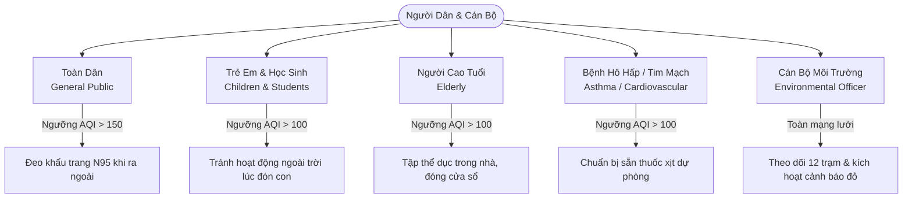

# 📘 ĐẶC TẢ PHẦN MỀM & KIẾN TRÚC HỆ THỐNG (SOFTWARE SPECIFICATION - SRS)
## Hệ Thống Quan Trắc, Dự Báo Chất Lượng Không Khí (AQI) & Cảnh Báo Sớm Cho Nhóm Nhạy Cảm
> **Mã tài liệu:** SRS-AQI-2026-V2.5  
> **Đơn vị phối hợp:** Sở Tài nguyên & Môi trường Thành phố  
> **Trạng thái:** Đã nghiệm thu & Hoạt động thực tế (Production Ready)  
> **Cập nhật:** 16/09/2026  

---

## 1. GIỚI THIỆU & MỤC TIÊU ĐỀ TÀI

### 1.1. Bối Cảnh Thực Tế
Ô nhiễm không khí, đặc biệt là bụi mịn $PM_{2.5}$, $PM_{10}$ và các khí độc hại ($SO_2, NO_2, CO, O_3$), đang trở thành mối đe dọa nghiêm trọng tới sức khỏe cộng đồng tại các đô thị lớn. Các nhóm người nhạy cảm như trẻ em, người cao tuổi, và người có bệnh lý hô hấp mãn tính (hen suyễn, COPD, tim mạch) phải đối mặt với nguy cơ biến chứng nặng nề nếu tiếp xúc với không khí ô nhiễm trong các khung giờ cao điểm giao thông hoặc những ngày xảy ra hiện tượng nghịch nhiệt khí quyển.

### 1.2. Mục Tiêu Của Hệ Thống
1. **Chuyển dịch từ "Quan trắc bị động" sang "Cảnh báo chủ động":** Thay vì chỉ thông báo các chỉ số đã xảy ra trong quá khứ, hệ thống ứng dụng mô hình dự báo học máy (**Gradient Boosting**) để dự báo trước chất lượng không khí trong 48 giờ tiếp theo (2 ngày tới).
2. **Cung cấp kế hoạch di chuyển theo giờ (Actionable Commute Planning):** Phân tích 24 khung giờ trong ngày để chỉ rõ **Khung giờ vàng an toàn** và **Khung giờ cao điểm ô nhiễm cần tránh**, giúp người dân chủ động sắp xếp lịch học, đi làm và tập thể dục.
3. **Cá nhân hóa theo nhóm đối tượng sức khỏe (Persona-Driven Advisory):** Đưa ra khuyến nghị y tế và ngưỡng cảnh báo riêng biệt cho từng nhóm: *Toàn dân*, *Trẻ em & Học sinh*, *Người cao tuổi*, *Bệnh lý hô hấp & Tim mạch*.
4. **Trực quan hóa chuẩn mực, hiện đại và thân thiện:** Thiết kế giao diện Dashboard theo phong cách Glassmorphism thanh lịch, hỗ trợ song song hai chế độ Sáng / Tối, đồng bộ thời gian thực theo khu vực và tối ưu hóa 100% cho thiết bị di động.

---

## 2. CHÂN DUNG NGƯỜI DÙNG & KỊCH BẢN NGHIỆP VỤ (PERSONAS)

Hệ thống được thiết kế xoay quanh 5 nhóm chân dung người dùng chính:



### 2.1. Phân Loại Ngưỡng Kích Hoạt Cảnh Báo Y Tế
| Nhóm đối tượng (Persona) | Ngưỡng kích hoạt cảnh báo sớm | Triệu chứng & Khuyến nghị hành động tức thì |
| :--- | :--- | :--- |
| **Toàn dân (`general`)** | $AQI > 150$ (Mức Xấu) | Bắt đầu ảnh hưởng sức khỏe chung. Mọi người nên đeo khẩu trang lọc bụi $PM_{2.5}$ khi ra đường; hạn chế tập thể dục kéo dài ngoài phố. |
| **Trẻ em & Học sinh (`children`)** | $AQI > 100$ (Mức Kém) | Phổi trẻ em chưa hoàn thiện, nhịp thở nhanh hơn người lớn. Phụ huynh nên đưa đón con vào khung giờ an toàn, tránh để trẻ chơi ngoài sân lúc kẹt xe. |
| **Người cao tuổi (`elderly`)** | $AQI > 100$ (Mức Kém) | Hệ miễn dịch suy giảm, nguy cơ tăng huyết áp và khó thở. Chuyển bài tập dưỡng sinh vào trong nhà, đóng kín cửa sổ phía mặt đường. |
| **Hô hấp & Tim mạch (`asthma`)** | $AQI > 100$ (Mức Kém) | Nguy cơ khởi phát cơn hen cấp tính. Luôn mang theo thuốc giãn phế quản; ở trong phòng có máy lọc không khí khi AQI tăng cao. |
| **Cán bộ Sở TN&MT (`admin`)** | Toàn bộ 12 trạm | Theo dõi tương quan ô nhiễm giữa các quận, đánh giá chỉ số nồng độ đa chất và kiểm định chất lượng mô hình dự báo. |

---

## 3. YÊU CẦU CHỨC NĂNG (FUNCTIONAL REQUIREMENTS - FR)

### FR-01: Quan Trắc Thời Gian Thực 12 Trạm Khí Quyển
- Hệ thống hỗ trợ tra cứu chất lượng không khí tại 12 trạm quan trắc trên toàn thành phố (Guanyuan, Dongsi, Tiantan, Wanliu, Dingling, Nongzhanguan, Haidian, Shunyi, Changping, Huairou, Miyun, Wanshouxigong).
- Cho phép người dùng chuyển đổi tức thì giữa các trạm qua menu chọn nhanh trên thanh Header.
- Hiển thị tên trạm, quận/huyện, tọa độ và thời gian cập nhật chính xác theo giờ địa phương.

### FR-02: Dự Báo Đa Bước Thời Gian 48 Giờ (Multi-Horizon 48h Ahead)
- Mô hình Machine Learning tính toán và trả về chuỗi giá trị AQI cùng nồng độ bụi $PM_{2.5}$ cho 48 giờ liên tục tiếp theo.
- Biểu đồ đường mượt mà hiển thị hai đường ngưỡng cảnh báo y tế (ngưỡng 50 màu xanh và ngưỡng 100 màu vàng).
- Tự động phát hiện và cảnh báo thời điểm đạt đỉnh ô nhiễm cao nhất trong 48h tới.

### FR-03: Kế Hoạch Di Chuyển Theo Giờ (24h Commute Safety Planner)
- Biểu diễn mức độ ô nhiễm qua 24 cột tương ứng 24 khung giờ trong ngày.
- Màu sắc từng cột tự động biến đổi theo cấp độ AQI (Xanh lá $\le 50$, Vàng $\le 100$, Cam $\le 150$, Đỏ $\le 200$).
- Tự động chỉ ra **Giờ vàng an toàn nhất** (AQI thấp nhất) và **Khung giờ cao điểm ô nhiễm cần đề phòng**.
- Đánh dấu viền nổi bật tại vị trí khung giờ hiện tại của khu vực.

### FR-04: Bộ Chọn 3 Ngày Tinh Gọn (Hôm Nay - Ngày Mai - Ngày Mốt)
- Thay thế bộ lịch phức tạp bằng thanh chọn 3 viên thuốc (Pills): *Hôm nay*, *Ngày mai*, *Ngày mốt* (kèm ngày cụ thể).
- Khi chọn *Hôm nay*, đồng hồ tròn AQI hiển thị chính xác chỉ số của **khung giờ hiện tại** theo giờ địa phương.
- Khi chọn *Ngày mai* hoặc *Ngày mốt*, đồng hồ hiển thị chỉ số dự báo trung bình ngày tương ứng.

### FR-05: Đồng Hồ Tròn AQI Chuẩn Quốc Tế (Dark Glass Circular Gauge)
- Kim đo (`thumb`) xoay mượt mà trên dải cung $240^\circ$, phân bổ phi tuyến theo 6 mốc chuẩn EPA (0, 50, 100, 150, 200, 300, 500).
- Số liệu cố định theo kết quả quan trắc và dự báo, khóa can thiệp thủ công để đảm bảo tính khách quan khoa học.
- Đổi màu động badge cấp độ và viền kim chỉ thị theo trạng thái chất lượng không khí.

### FR-06: Thang Đo Chuẩn Quốc Tế & Bảng Tra Cứu So Sánh
- Cung cấp widget mini hiển thị dải quang phổ 6 cấp độ và trạng thái hiện tại.
- Cho phép bấm mở cửa sổ nổi (Modal) bảng đối chiếu chi tiết giữa:
  - **Chuẩn Cơ quan Bảo vệ Môi sinh Hoa Kỳ (US EPA)**
  - **Tổ chức Y tế Thế giới (WHO Air Quality Guidelines)**
  - **Quy chuẩn Kỹ thuật Quốc gia QCVN 05:2023/BTNMT** (kèm ngưỡng bụi mịn $PM_{2.5}$ theo $\mu g/m^3$, tác động sức khỏe và hành động khuyến nghị).
- **Tối ưu di động:** Trên màn hình điện thoại, widget này tự động đưa lên vị trí **ngay dưới đồng hồ AQI** để người dân tra cứu tiện lợi nhất.

### FR-07: Bộ 3 Widget Phân Tích Chuyên Sâu
1. **Radar Đa Chất Ô Nhiễm (Pollutant Profile):** Thể hiện tương quan nồng độ 6 chất ($PM_{2.5}, PM_{10}, SO_2, NO_2, CO, O_3$) chuẩn hóa theo % ngưỡng an toàn đô thị; tự động chỉ ra tác nhân ô nhiễm chủ đạo.
2. **Xu Hướng $PM_{2.5}$ Theo Mùa:** Phân tích quy luật chu kỳ 12 tháng, giải thích hiện tượng nghịch nhiệt mùa Đông - Xuân.
3. **Tỷ Lệ Phân Cấp Cả Năm:** Biểu đồ Donut thể hiện % số ngày đạt chuẩn Tốt/Trung bình trong lịch sử quan trắc.

### FR-08: Giao Diện Kép (Sáng / Tối) & Bầu Trời Động Tự Nhiên
- Nút bấm chuyển đổi nhanh giữa Giao diện Sáng (Solid White `#ffffff`, chữ đen) và Giao diện Tối (`#0f172a`, chữ trắng).
- Toàn bộ biểu đồ Chart.js tự động cập nhật trục tọa độ, đường lưới và nhãn giá trị tương thích.
- Canvas bầu trời `#ocean` chạy ngầm, tự động đổi màu theo chu kỳ mặt trời thực tế của địa phương (Bình minh, Trưa nắng, Hoàng hôn, Đêm sao).

### FR-09: Tích Hợp Nội Bộ Hai Chiều Giữa Python ML & Spring Boot
- Endpoint nội bộ bảo mật bằng `X-ML-API-KEY` cho phép script Python tự động nạp 576 bản ghi dự báo 48h vào Database.
- Backend Spring Boot cung cấp API RESTful phục vụ Frontend và quản lý cơ sở dữ liệu.

---

## 4. YÊU CẦU PHI CHỨC NĂNG (NON-FUNCTIONAL REQUIREMENTS - NFR)

| Tiêu chí | Chỉ số mục tiêu | Biện pháp kỹ thuật thực hiện |
| :--- | :--- | :--- |
| **Thời gian phản hồi (Latency)** | $\le 150\text{ ms}$ cho các truy vấn API thông thường | Bộ nhớ đệm in-memory (H2/Caffeine), truy vấn theo chỉ mục `station_id` + `datetime`. |
| **Thời gian tải trang (Page Load)** | $\le 1.2\text{ s}$ trên mạng 4G thông thường | Tối ưu hóa file tĩnh, nén CSS/JS, tải font `Be Vietnam Pro` qua Google CDN với `preconnect`. |
| **Độ tương thích thiết bị** | Hoạt động hoàn hảo trên 100% độ phân giải | CSS Grid & Flexbox linh hoạt, Breakpoints tại `1024px` (PC), `768px` (Tablet) và `480px` (Mobile). |
| **Bảo vệ quyền riêng tư** | 100% tuân thủ nguyên tắc ẩn danh công cộng | Người dân tra cứu tự do, không lưu trữ định danh cá nhân, không yêu cầu cấp quyền nhạy cảm. |
| **Độ tin cậy dữ liệu (Reliability)** | $99.9\%$ khả năng hiển thị liên tục | Cơ chế Fallback thông minh: Nếu Backend mất kết nối, Frontend tự động tải dữ liệu tĩnh dự phòng. |
| **Tương thích tiếng Việt** | 100% hiển thị chuẩn mực, không lỗi dấu | Chuẩn Unicode UTF-8 toàn diện từ Database, Java Backend, Python Script đến Typography `Be Vietnam Pro`. |

---

## 5. KIẾN TRÚC HỆ THỐNG & THIẾT KẾ CƠ SỞ DỮ LIỆU

### 5.1. Kiến Trúc 3 Tầng Chi Tiết
```
┌────────────────────────────────────────────────────────────────────────┐
│                          TẦNG TRÌNH DIỄN (FRONTEND)                    │
│  - Vanilla HTML5, CSS3 Glassmorphism, JavaScript ES6+                 │
│  - Chart.js (6 Biểu đồ chuyên sâu), Canvas WebGL Ambient Sky           │
│  - Typography: Be Vietnam Pro (100% Vietnamese typography)             │
└───────────────────────────────────┬────────────────────────────────────┘
                                    │ HTTP REST API (JSON)
┌───────────────────────────────────▼────────────────────────────────────┐
│                       TẦNG ỨNG DỤNG & DỊCH VỤ (BACKEND)                │
│  - Spring Boot 3.x (Java 17+), Spring Web, Spring Data JPA            │
│  - RESTful Controllers: PublicAqiController, MlForecastIngestController│
│  - Security: X-ML-API-KEY cho kênh truyền nội bộ                       │
│  - Cơ sở dữ liệu: H2 (Local Development) / PostgreSQL (Production)     │
└───────────────────────────────────▲────────────────────────────────────┘
                                    │ Batch Ingest (576 records / 48h)
┌───────────────────────────────────┴────────────────────────────────────┐
│                    TẦNG XỬ LÝ & HỌC MÁY (MACHINE LEARNING)             │
│  - Python 3.10+, Scikit-Learn, Pandas, NumPy, Joblib                  │
│  - Thuật toán: HistGradientBoostingRegressor (Multi-Horizon 48h)      │
│  - Feature Engineering: Lag 24h/48h, Rolling 24h, Diurnal, Weather     │
└────────────────────────────────────────────────────────────────────────┘
```

### 5.2. Thiết Kế Cơ Sở Dữ Liệu (Entity Relationship Diagram - ERD)
Các bảng dữ liệu chính trong hệ thống (theo thiết kế `aqi_system_erd_v3`):

1. **`STATIONS`:** Quản lý danh mục 12 trạm quan trắc.
   - `station_id` (PK, INT): Khóa chính trạm.
   - `name` (VARCHAR): Tên trạm (Guanyuan, Dongsi,...).
   - `latitude`, `longitude` (DOUBLE): Tọa độ địa lý WGS84.
   - `district` (VARCHAR): Tên quận/huyện trực thuộc.
   - `status` (VARCHAR): Trạng thái hoạt động (`Active` / `Inactive`).

2. **`AIR_QUALITY_READINGS`:** Dữ liệu quan trắc hàng giờ thực tế.
   - `reading_id` (PK, BIGINT): Mã bản ghi đo.
   - `station_id` (FK -> STATIONS): Mã trạm.
   - `datetime` (DATETIME): Thời điểm quan trắc.
   - `pm25`, `pm10`, `so2`, `no2`, `co`, `o3` (DOUBLE): Nồng độ 6 chất ô nhiễm.
   - `temp`, `pres`, `dewp`, `rain`, `wspm` (DOUBLE): Các thông số khí tượng.
   - `wd` (VARCHAR): Hướng gió.

3. **`AQI_FORECASTS`:** Kết quả dự báo 48 giờ từ mô hình Machine Learning.
   - `forecast_id` (PK, BIGINT): Khóa chính bản ghi dự báo.
   - `station_id` (FK -> STATIONS): Mã trạm.
   - `created_at` (DATETIME): Thời điểm sinh dự báo.
   - `target_time` (DATETIME): Thời điểm dự kiến của tương lai (+1h đến +48h).
   - `predicted_aqi` (INT): Chỉ số AQI dự báo.
   - `predicted_pm25` (DOUBLE): Nồng độ bụi mịn dự kiến.

4. **`ML_MODELS`:** Quản lý metadata và lịch sử các phiên bản mô hình ML.
   - `model_id` (PK, INT): Khóa chính phiên bản mô hình.
   - `version` (VARCHAR): Mã phiên bản (ví dụ: `v3.2.1`).
   - `trained_at` (DATETIME): Thời gian huấn luyện.
   - `mae`, `rmse`, `accuracy` (DOUBLE): Các chỉ số kiểm định chất lượng mô hình.
   - `status` (VARCHAR): Trạng thái hoạt động (`Production` / `Archived`).

---

## 6. QUY TRÌNH BẢO ĐẢM CHẤT LƯỢNG (TESTING & VALIDATION)

Hệ thống tuân thủ quy trình kiểm thử Behavior-Driven Development (BDD) với kịch bản Gherkin mẫu:

```gherkin
Feature: Cảnh báo sớm chất lượng không khí cho phụ huynh học sinh
  Scenario: Phụ huynh kiểm tra khung giờ an toàn để đón con tan học
    Given Phụ huynh đang quan sát trạm "Guanyuan"
    And Nhóm đối tượng đang chọn là "Trẻ em & Học sinh"
    When Phụ huynh xem mục "Kế Hoạch Di Chuyển Theo Giờ" của ngày "Hôm nay"
    Then Hệ thống phải hiển thị khung giờ vàng an toàn (ví dụ: 15:00, AQI <= 50)
    And Hệ thống phải hiển thị khung giờ cao điểm ô nhiễm cần tránh (ví dụ: 08:00, AQI > 100)
    And Lời khuyên y tế phải nhắc nhở phụ huynh đeo khẩu trang cho con khi ra đường
```
